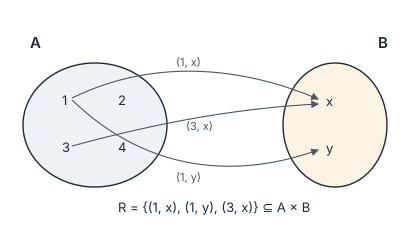
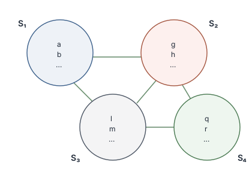
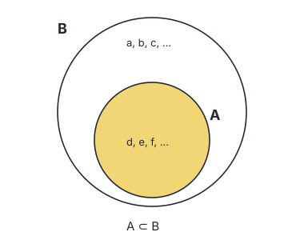
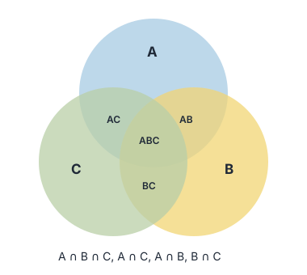

# Specifica DAPPREMO

**Data Protection and Privacy Relationships Model**

Versione: 1.1.0
Stato: Rilasciata
Autore: Nicola Fabiano
Licenza: CC BY 4.0 (si vedano [`../LICENSE`](../LICENSE) e [`../NOTICE.md`](../NOTICE.md))

---

## 0. Stato di questo documento

*(Sezione non normativa.)*

Questo documento è la traduzione italiana della specifica canonica del Data
Protection and Privacy Relationships Model (DAPPREMO). Il testo inglese
[`dappremo-spec.en.md`](dappremo-spec.en.md) è canonico: ove le due versioni
divergano, prevale il testo inglese.

La specifica riformula in termini normativi un modello descritto in forma
discorsiva in una serie di pubblicazioni, registrate in
[`../PUBLICATIONS.md`](../PUBLICATIONS.md).

**Espansione canonica dell'acronimo.** DAPPREMO sta per *Data Protection and
Privacy Relationships Model*. Alcuni passaggi delle pubblicazioni di origine lo
rendono come *Data Protection Relationships Model*; quella forma abbreviata è
superata e non va usata.

**Base testuale e autorità.** Sono due cose distinte. La *base testuale* di
questa specifica comprende la versione JSCI 2021 e la sua traduzione italiana
del 2023, essendo le versioni il cui regime dei diritti ne consente la
rielaborazione. La *versione più recente sottoposta a revisione paritaria* è il
capitolo del 2024 pubblicato negli atti dell'11° Annual Privacy Forum. Ove le
due divergano su un punto di sostanza, prevale la pubblicazione successiva, e
questa specifica la segue — enunciando con parole proprie ciò che essa
stabilisce. `PUBLICATIONS.md` registra il regime dei diritti di ciascuna fonte.

**Originalità.** Questa specifica è un'opera originale. Non riproduce il testo di
alcuna delle pubblicazioni elencate, tutte soggette alle condizioni dei
rispettivi editori. La versione italiana è una traduzione originale del testo
inglese di questo repository e non deriva dalla traduzione pubblicata nel 2023.

**Sezioni normative e non normative.** Le sezioni 3, 4, 5, 6, 7, 8, 9 e 10 sono
normative: enunciano che cosa il modello *è* e che cosa è richiesto a una
valutazione che ne dichiari la conformità. Le sezioni 0, 1, 11, 12 e 13 sono
informative. La sezione 2 enuncia le convenzioni notazionali e l'interpretazione
delle parole chiave di requisito usate nelle sezioni normative.

**Che cosa cambia nella versione 1.1.0.** Questa versione enuncia come normative
tre materie che la versione 1.0.1 lasciava alle sezioni informative o non
enunciava affatto: la priorità ontologica delle relazioni sugli oggetti che esse
mettono in relazione (sezione 7), lo stato epistemico degli oggetti rispetto a
una valutazione (sezione 8), e il carattere generativo del modello con il
troncamento che ne consegue (sezione 9). Enuncia inoltre, alla sezione 10, che
cosa è richiesto a una valutazione che dichiari conformità. Le sezioni da 3 a 6
sono immutate; gli identificatori D1–D7, R1–R5 e A1–A5 conservano il loro
significato. La sostanza del modello è immutata: ciò che si aggiunge vi era
implicito, ed è qui reso esplicito e verificabile.

**Questioni aperte.** Due elementi presenti nelle pubblicazioni di origine non
sono deliberatamente enunciati come normativi, perché dichiarati dall'autore
come in corso di sviluppo e non formalmente stabiliti: la caratterizzazione del
modello mediante relazioni di equivalenza e lo sviluppo formale dell'analogia
con il fibrato. Sono esposti alla sezione 12, insieme al programma di lavoro
dichiarato dall'autore.

---

## 1. Introduzione

*(Sezione non normativa.)*

La conformità alle regole in materia di protezione dei dati e privacy è
comunemente affrontata come verifica di una lista di controllo rispetto a un
corpo normativo. Quell'impostazione tratta le regole come un oggetto autonomo, e
l'attività da valutare come qualcosa *a cui* le regole si applicano.

DAPPREMO propone una lettura diversa. Qualsiasi area di attività — un settore
della pubblica amministrazione, il core business di un'impresa, un ecosistema
Internet of Things, un singolo progetto di sviluppo software — può essere
descritta come un insieme i cui oggetti sono le sue regole, attività e processi.
Anche la protezione dei dati personali e la privacy costituiscono un insieme di
questo tipo. Ciò che rileva non è allora l'applicazione dell'uno all'altra, ma
le **relazioni** tra essi: relazioni dinamiche anziché statiche, che possono
collegare interi domini o singoli oggetti al loro interno, e che vanno lette su
più dimensioni anziché su un solo piano.

Lo scopo del modello è duplice. Primo, ottenere una visione più ampia e più
precisa di uno scenario di quanto consenta una lettura bidimensionale delle
regole. Secondo — ed è l'affermazione che l'autore sottolinea nella versione del
2024 — portare in evidenza oggetti rilevanti per lo scenario ma abitualmente
trascurati, deliberatamente o per disattenzione. Il valore del modello sta tanto
in ciò che fa emergere quanto nel modo in cui organizza ciò che è già noto.

Le sezioni da 3 a 6 enunciano il nucleo insiemistico del modello. Quel nucleo è
necessario ma non basta a rendere conto di ciò a cui il modello serve.
Un'analisi che identificasse ogni dominio e ogni relazione, e riferisse gli
oggetti trovati senza riferire ciò che non ha raggiunto, soddisferebbe le
sezioni da 3 a 6 e mancherebbe lo scopo appena enunciato. Le sezioni da 7 a 9
enunciano ciò che quello scopo richiede: che le relazioni sono anteriori agli
oggetti che mettono in relazione, che la posizione di un oggetto rispetto a una
valutazione è essa stessa qualcosa che la valutazione deve registrare, e che
nessuna valutazione condotta secondo questo modello è completa. La sezione 10
enuncia che cosa una valutazione deve fare per dichiararne la conformità.

I destinatari sono le autorità di controllo, i titolari e i responsabili del
trattamento, i responsabili della protezione dei dati e i consulenti, e chi si
occupa della rappresentazione formale dei concetti di protezione dei dati e
privacy.

---

## 2. Convenzioni notazionali

Le sezioni normative usano la notazione insiemistica standard:

| Notazione | Significato |
|---|---|
| `{a, b, c, …}` | l'insieme i cui elementi sono a, b, c, … |
| `a ∈ A` | a è un elemento di A |
| `A ⊂ B` | A è un sottoinsieme di B |
| `A ∪ B` | unione di A e B |
| `A ∩ B` | intersezione di A e B |
| `A × B` | prodotto cartesiano di A e B |
| `R` | una relazione |
| `a R b` | a è in relazione con b secondo R |
| `Sᵢ ∼ Sⱼ` | Sᵢ e Sⱼ sono connessi (si veda R2) |
| `∃` | esiste |
| `⟺` | se e solo se |
| `∅` | l'insieme vuoto |

Le definizioni sono numerate `D1`–`D7`, i tipi di relazione `R1`–`R5`, le
assunzioni `A1`–`A8`, le categorie epistemiche `E1`–`E5` e le proprietà
generative `G1`–`G4`. I riferimenti nella forma "si veda D3" rinviano a questi
identificatori.

**Parole chiave di requisito.** Le parole DEVE, NON DEVE, DOVREBBE, NON DOVREBBE
e PUÒ nelle sezioni normative vanno interpretate come descritto nella RFC 2119 e
nella RFC 8174, e soltanto quando compaiono in maiuscolo. Ove le stesse parole
compaiano in minuscolo hanno il loro significato ordinario e non enunciano alcun
requisito. Nel testo inglese, che è canonico, le parole corrispondenti sono
MUST, MUST NOT, SHOULD, SHOULD NOT e MAY.

**Valutazione.** Nelle sezioni normative, una *valutazione* è una particolare
applicazione di questo modello a uno scenario dichiarato, condotta da un agente
(D7), da cui risultano i domini, le relazioni e gli oggetti che rilevano per
quello scenario. I requisiti rivolti a "una valutazione" sono rivolti all'agente
che la conduce.

---

## 3. Definizioni

*(Sezione normativa.)*

**D1 — Dominio.**
Un *dominio* è un insieme che rappresenta un'area di attività delimitata. Sono
esempi di dominio un settore della pubblica amministrazione, il core business di
un'impresa privata, un ecosistema Internet of Things, un progetto di sviluppo
software, e l'area stessa della protezione dei dati personali e della privacy. I
domini si denotano con `S₁, S₂, S₃, …` oppure, ove convenga, con `A`, `B`, `C`.

**D2 — Oggetto.**
Un *oggetto* è un elemento di un dominio. Gli oggetti possono essere statici o
dinamici: norme giuridiche, principi etici, attività e i processi che tali
attività costituiscono sono tutti oggetti. Un dominio è compiutamente descritto
dai suoi oggetti insieme alle relazioni in cui essi stanno (si veda la sezione
4).

**D3 — Proprietà caratteristica.**
Una *proprietà caratteristica* è la proprietà che accomuna tutti e soli gli
oggetti di un dato dominio. Per il dominio della protezione dei dati personali e
della privacy, la proprietà caratteristica è l'**effetto applicativo** dei suoi
oggetti — l'effetto che essi producono quando applicati a uno scenario concreto.

Da D3 segue che un dominio può contenere oggetti di natura eterogenea. Un
principio etico non è enunciato in alcuna legge sulla protezione dei dati, e
tuttavia è un oggetto del dominio della protezione dei dati personali, perché
condivide con le norme giuridiche la proprietà caratteristica di quel dominio:
produce lo stesso tipo di effetto applicativo. L'appartenenza a un dominio è
determinata dalla proprietà caratteristica, non dalla fonte formale
dell'oggetto.

**D4 — Insieme delle regole sulla privacy (P).**
`P` denota l'insieme i cui oggetti sono le norme giuridiche che disciplinano la
privacy e la protezione delle persone fisiche con riguardo al trattamento dei
dati personali, entro un ordinamento giuridico dichiarato. Ove l'ordinamento sia
quello dell'Unione europea, `P` comprende in particolare il Regolamento (UE)
2016/679.

**D5 — Insieme dei principi etici (E).**
`E` denota l'insieme i cui oggetti sono i principi etici che rilevano per il
trattamento dei dati personali e per la privacy. `E` non è un sottoinsieme di
`P`: i suoi oggetti non sono enunciati in norme giuridiche. È nondimeno un
insieme di oggetti che condividono la proprietà caratteristica descritta in D3.

**D6 — Insieme di riferimento (B).**
L'*insieme di riferimento* `B` è definito come:

> `B = P ∪ E`

`B` è il dominio rispetto al quale gli altri domini sono valutati secondo questo
modello. L'uso di `B` anziché del solo `P` è una scelta sostanziale: rende
esplicito che la valutazione di uno scenario non può ridursi alle norme
giuridiche vigenti.

**D7 — Agente.**
Un *agente* è una persona o un ente che agisce entro un dominio e trae
conseguenze dalle relazioni in cui quel dominio sta. Sono agenti le autorità di
controllo, i titolari e i responsabili del trattamento, i responsabili della
protezione dei dati e i consulenti, e gli interessati. Gli agenti possono essere
persone fisiche o organizzazioni. Gli agenti non sono oggetti di un dominio:
agiscono sui domini e sulle loro relazioni.

---

## 4. Tipi di relazione

*(Sezione normativa.)*

**R1 — Relazione.**
Dati due insiemi non vuoti `A` e `B`, una *relazione* `R` tra `A` e `B` è un
qualsiasi sottoinsieme del loro prodotto cartesiano:

> `R ⊆ A × B`

Ove la coppia ordinata `(a, b)` appartenga a `R`, gli elementi `a ∈ A` e
`b ∈ B` si dicono in relazione secondo `R`, scritto `a R b`.

Da R1 segue che una relazione non deve necessariamente coinvolgere ogni elemento
dell'uno o dell'altro insieme. Un elemento di `A` che non è in relazione con
alcun elemento di `B` è *non correlato* secondo `R`; tali elementi sono ammessi e
non costituiscono un difetto del modello. Segue altresì che un singolo elemento
di `A` può essere in relazione con più elementi di `B`.

*Figura 1 — Una relazione come sottoinsieme del prodotto cartesiano. Gli elementi
2 e 4 di A non sono in relazione con nulla secondo R.*

**R2 — Connessione tra domini.**
Data una famiglia di domini `(S₁, S₂, S₃, …, Sₙ)`, due di essi sono *connessi*
quando tra loro sussiste una qualche relazione:

> `Sᵢ ∼ Sⱼ ⟺ ∃R tale che Sᵢ R Sⱼ`

Un dominio può essere connesso a più domini contemporaneamente, e in tal caso la
configurazione è *uno-a-molti*; ove sia connesso a un solo dominio, la
configurazione è *uno-a-uno*.

*Figura 2 — Connessioni entro una famiglia di domini. S₁ è connesso sia a S₂ sia
a S₃, in configurazione uno-a-molti.*

**R3 — Inclusione forte.**
Ove ogni oggetto di un dominio `A` sia anche oggetto dell'insieme di riferimento
`B`:

> `A ⊂ B`

L'inclusione forte afferma che tutte le regole dell'area descritta da `A` sono
anche regole sulla privacy o principi etici. È un'affermazione impegnativa e
raramente si verificherà. R3 è enunciata perché è il caso limite, non perché sia
quello atteso; ove uno scenario non la soddisfi, si deve usare R4.

*Figura 3 — Inclusione forte: ogni oggetto di A è anche oggetto di B.*

**R4 — Relazione debole.**
Qualunque sia il dominio `A` delle regole che disciplinano una particolare area,
esiste un appropriato sottoinsieme dell'insieme di riferimento al quale `A` è in
relazione:

> `∃ A′ ⊂ B tale che A R A′`

R4 è il caso generale del modello ed è da preferire a R3 nella valutazione di
scenari concreti. Enuncia che gli oggetti di `A` non devono essere essi stessi
regole di protezione dei dati, privacy o etica: essi sono *in relazione con*
quelle regole, e le regole così correlate costituiscono il sottoinsieme `A′`
dell'insieme di riferimento che `A` coinvolge.

L'identificazione di `A′` per un dato `A` è l'operazione analitica centrale
secondo questo modello: determina quali regole e principi siano effettivamente
coinvolti dall'area in valutazione. Il sottoinsieme così identificato è detto
*sottoinsieme coinvolto*.

**R5 — Intersezione.**
Due o più domini possono condividere oggetti. Ove lo facciano, gli oggetti
condivisi costituiscono la loro intersezione:

> `A ∩ B`, e per tre domini `A ∩ B ∩ C`, `A ∩ C`, `B ∩ C`

L'intersezione di un dominio con l'insieme di riferimento identifica gli oggetti
che appartengono a entrambi, e dunque l'area in cui la valutazione del dominio e
la valutazione della protezione dei dati e della privacy coincidono.

*Figura 4 — Intersezioni tra tre domini. Ove A sia il dominio della protezione
dei dati personali, le regioni ombreggiate identificano gli oggetti che esso
condivide con gli altri.*

---

## 5. Assunzioni

*(Sezione normativa.)*

**A1 — Non autonomia dell'insieme di riferimento.**
L'insieme di riferimento `B` non genera autonomamente attività. Un corpo di
regole, per quanto completo, non comporta di per sé il compimento di alcuna
attività; opera attraverso la condotta concreta degli agenti identificati in D7.
L'esistenza di `B` è necessaria e funzionale ad altri domini, con i quali deve
stare in relazione.

**A2 — Eterogeneità degli oggetti.**
Un dominio può contenere oggetti di natura diversa, purché condividano la sua
proprietà caratteristica (D3). L'insieme di riferimento contiene su questa base
tanto norme giuridiche quanto principi etici.

**A3 — Dinamismo delle relazioni.**
Le relazioni tra domini sono dinamiche, non statiche. Variano nel tempo e con lo
scenario. Una valutazione condotta secondo questo modello è pertanto valida
rispetto a uno scenario dichiarato in un tempo dichiarato, e va ripetuta al
mutare dell'uno o dell'altro.

**A4 — Numero illimitato di domini.**
Il numero di domini che possono essere considerati non è predeterminato ed è
potenzialmente illimitato. La complessità di una valutazione cresce con il
numero di domini che vi sono ammessi. La selezione dei domini rilevanti per uno
scenario è una decisione analitica da dichiarare esplicitamente.

**A5 — Presenza dell'insieme di riferimento.**
In ogni valutazione delle relazioni tra domini secondo questo modello, l'insieme
di riferimento `B` è presente. Nessuna area di attività è esente dalle regole
sulla protezione delle persone fisiche con riguardo al trattamento dei dati
personali, salvo che un ordinamento specifico disponga diversamente.

**A6 — Priorità delle relazioni.**
Le relazioni non sono accidenti di oggetti che esisterebbero indipendentemente
da esse. La qualificazione di un oggetto secondo questo modello è determinata
dalle relazioni in cui esso sta (si veda la sezione 7), ed esistono secondo
questo modello oggetti che nessun dominio contiene e che le sole relazioni
costituiscono. A6 non nega che gli oggetti di un dominio esistano nel senso
ordinario; enuncia che cosa determini ciò che essi *sono* ai fini di una
valutazione.

**A7 — Non riducibilità delle relazioni.**
Ciò che sussiste tra domini non è ricavabile da un'ispezione di quei domini
presi separatamente. A7 è il fondamento della pretesa pratica del modello: se le
relazioni fossero ricavabili dai domini, un'analisi condotta dominio per dominio
basterebbe, e nulla sarebbe sistematicamente trascurato.

**A8 — Dipendenza dall'osservatore.**
Ciò che è visibile in uno scenario è determinato dalla posizione da cui lo
scenario è osservato. A8 non rende arbitraria una valutazione: due valutazioni
condotte da posizioni dichiarate sono confrontabili, e la loro divergenza è
informativa. Rende la posizione parte di ciò che una valutazione riferisce.

---

## 6. Multidimensionalità

*(Sezione normativa.)*

Le relazioni descritte alla sezione 4 non vanno lette su un solo piano. Una
rappresentazione bidimensionale, come un diagramma di Venn, è una proiezione:
adeguata a illustrare una singola relazione, inadeguata a rappresentare il
quadro nel suo complesso.

Il quadro va letto come una rete distribuita multidimensionale, in cui ciascun
nodo è un dominio e ciascun arco una relazione tra domini. Piani distinti della
rappresentazione sono strati di un unico sistema, non sistemi separati.

*Figura 5 — Il quadro letto come rete distribuita. Ciascun nodo è un dominio,
ciascun arco una relazione. La figura è essa stessa una proiezione bidimensionale
di una struttura da leggere su più piani.*

La conseguenza pratica è una regola di metodo. Ove una valutazione di uno
scenario appaia completa su un solo piano, essa va trattata come incompleta
finché non siano state considerate le relazioni sussistenti su altri piani. La
posizione dell'osservatore determina ciò che è visibile; mutare quella posizione
— allargando il campo visivo fino a comprendere le diverse parti e i diversi
processi coinvolti — porta in evidenza relazioni prima non osservabili.

---

## 7. Relazioni e qualificazione

*(Sezione normativa.)*

La sezione 4 enuncia quali siano i tipi di relazione. Questa sezione enuncia ciò
che da A6, A7 e A8 segue per la conduzione di una valutazione.

**7.1 Contesto relazionale.**
Il *contesto relazionale* di una valutazione è l'insieme delle relazioni che
quella valutazione considera congiuntamente. Un contesto relazionale non è la
totalità delle relazioni sussistenti in uno scenario, che è illimitata (A4), ma
la selezione operata dalla valutazione. Una valutazione DEVE dichiarare il
proprio contesto relazionale.

**7.2 Qualificazione.**
La *qualificazione* di un oggetto o di un dominio è ciò che esso è ritenuto
essere sotto un contesto relazionale dichiarato. La qualificazione è relativa a
quel contesto, non intrinseca all'oggetto. Uno stesso oggetto PUÒ essere
qualificato diversamente sotto contesti relazionali diversi, e nessuna delle due
qualificazioni è per ciò stesso erronea: ciascuna vale sotto il proprio
contesto.

Una valutazione che riferisca una qualificazione DEVE riferire il contesto
relazionale sotto il quale essa è stata raggiunta. Una qualificazione riferita
senza il suo contesto enuncia meno di quanto sembri enunciare.

Una qualificazione è *invariante rispetto al contesto* ove valga sotto ogni
contesto relazionale in cui l'oggetto compare. L'invarianza è un'affermazione
forte e NON DEVE essere asserita ove non sia stata dimostrata. La presenza
dell'insieme di riferimento in ogni valutazione (A5) è asserita da questo modello
come invariante.

**7.3 Costituzione.**
Un oggetto è *costituito per relazione* ove non sia anteriore alle relazioni da
cui sorge ma sia da esse determinato.

La costituzione è distinta dall'appartenenza. Un oggetto di un dominio è membro
di quel dominio e può essere ispezionato al suo interno. Un oggetto costituito
per relazione non appartiene ad alcun dominio e non può essere ispezionato
all'interno di alcuno: è raggiungibile soltanto attraverso le relazioni che lo
costituiscono. Ove quelle relazioni non siano considerate, un oggetto siffatto
non è semplicemente mancato — non è disponibile per essere mancato.

**7.4 Piani e punto di osservazione.**
Un *piano di osservazione* è uno dei diversi piani lungo i quali le relazioni di
uno scenario sono lette, inteso come strato di un unico sistema (sezione 6). Un
*punto di osservazione* è la posizione dalla quale una valutazione osserva uno
scenario, e che determina quali relazioni le siano visibili (A8).

Una valutazione DEVE dichiarare il punto di osservazione dal quale è stata
condotta. Ove sia stata condotta da più punti di osservazione, DEVE dichiararli
tutti, e DOVREBBE dichiarare che cosa da ciascuno sia divenuto visibile che dagli
altri non lo era.

---

## 8. Stato epistemico degli oggetti

*(Sezione normativa.)*

Le categorie che seguono classificano un oggetto in base alla sua posizione
rispetto a una data valutazione. Lo stato epistemico è relativo a una valutazione
e non è proprietà intrinseca dell'oggetto: uno stesso oggetto può essere
identificato in una valutazione e trascurato in un'altra.

**E1 — Identificato.**
Oggetto che la valutazione ha raggiunto e preso in considerazione.

**E2 — Trascurato.**
Oggetto rilevante per lo scenario che la valutazione avrebbe potuto raggiungere
e non ha preso in considerazione. Si distinguono due casi:

- **E2a — Trascurato intenzionalmente.** Oggetto trascurato che la valutazione
  ha messo da parte per decisione. La decisione DEVE essere dichiarata insieme
  al suo fondamento.
- **E2b — Trascurato involontariamente.** Oggetto trascurato che la valutazione
  non ha raggiunto senza aver deciso di escluderlo. È tipicamente il prodotto di
  una lettura su un solo piano (sezione 6).

La distinzione rileva in termini di accountability: una decisione di esclusione
è una decisione riesaminabile e della quale possono essere richieste le ragioni,
mentre un'omissione inavvertita non lo è.

**E3 — Sconosciuto.**
Oggetto rilevante per lo scenario che la valutazione non era in condizione di
raggiungere, perché la sua esistenza non era manifesta. E3 è distinto da E2: ciò
che è trascurato era disponibile e non è stato preso in considerazione, ciò che
è sconosciuto non era disponibile. Il modello affronta E3 attraverso le
relazioni, che fanno emergere oggetti che l'ispezione diretta di un dominio non
fa emergere.

**E4 — Indeterminabile.**
Oggetto la cui presenza è manifesta ma la cui estensione o il cui contenuto non
possono essere risolti entro la valutazione. E4 è registrato perché gli attributi
di un dominio sono in parte precisi e identificati e in parte indefiniti; una
valutazione che riferisca soltanto ciò che ha potuto determinare travisa la
propria completezza.

**E5 — Emergente.**
Oggetto che nessun dominio contiene e che sorge dalle relazioni tra domini,
identificabile analizzando quelle relazioni anziché ispezionando i domini (7.3).
Si distinguono due casi:

- **E5a — Oggetto di intersezione.** Oggetto costituito dall'incontro di due o
  più relazioni.
- **E5b — Oggetto limite.** Oggetto determinato da una famiglia di relazioni
  presa nel suo insieme, che nessuna singola relazione di quella famiglia
  determina. Un oggetto limite sta alle relazioni che lo determinano come
  l'inviluppo sta alla famiglia di rette a esso tangenti: non è tracciato, e non
  è una delle rette, eppure è da esse compiutamente determinato.

Mentre E5a si raggiunge esaminando due relazioni, E5b si raggiunge soltanto
considerando la famiglia per intero. Una valutazione che proceda a coppie non
perverrà a un oggetto limite, per quanto a lungo sia proseguita.

Una valutazione DEVE registrare lo stato epistemico degli oggetti che riferisce.
Una valutazione NON DEVE riferire un oggetto come identificato (E1) ove il
fondamento per farlo sia che non è stata trovata indicazione contraria.

---

## 9. Generatività e troncamento

*(Sezione normativa.)*

**G1 — Struttura generativa.**
Il modello non contiene i propri oggetti: li produce. Gli oggetti di una
valutazione sono determinati dalle relazioni che vi sono ammesse, e il loro
numero non è fissato in anticipo. Una struttura di questo tipo differisce da un
contenitore per un aspetto che rileva direttamente sul metodo: un contenitore può
in linea di principio essere inventariato, una struttura generativa no.

**G2 — Infinito potenziale.**
I punti in cui le relazioni si incontrano sono potenzialmente infiniti: date le
relazioni sussistenti in uno scenario, ulteriori punti possono sempre essere
determinati, ma nessuna valutazione li contiene tutti. È in questo senso che A4
enuncia come potenzialmente illimitato il numero di domini ammessi.

Da G2 segue che gli oggetti costituiti per relazione (7.3) non ammettono
enumerazione, e che il passaggio dalle relazioni di uno scenario all'oggetto che
una famiglia di esse congiuntamente determina (E5b) è un passaggio di natura e
non soltanto di numero. Una valutazione che tratti un oggetto limite come una
maggiore quantità di oggetti di intersezione lo cercherà nel modo sbagliato.

**G3 — Specificazione intensionale.**
Poiché gli oggetti non sono enumerabili, essi sono specificati dalla regola che
li determina a partire dalle relazioni, e non elencandoli. Un'espressione di
questo modello in forma leggibile da una macchina DEVE dichiarare le relazioni e
la regola in base alla quale gli oggetti ne sono derivati, e NON DEVE pretendere
di enumerare gli oggetti.

**G4 — Troncamento.**
Poiché gli oggetti sono potenzialmente infiniti (G2), ogni valutazione condotta
secondo questo modello si arresta prima che essi siano esauriti. Che una
valutazione sia troncata non è pertanto un difetto ma un carattere strutturale.

Una valutazione DEVE dichiarare il proprio *criterio di troncamento*: il
fondamento in base al quale ha cessato di generare ulteriori oggetti. Tra i
fondamenti si annoverano l'esaurimento delle relazioni selezionate, il
raggiungimento di un piano di osservazione dichiarato, e il giudizio che
ulteriori oggetti non rileverebbero per lo scenario. Ove il fondamento sia un
giudizio siffatto, la valutazione DEVE dichiararlo come giudizio, essendo il
fondamento più idoneo a occultare un'omissione intenzionale (E2a).

Una valutazione che non dichiari il proprio troncamento è *non dichiarata*, e
presenta come completa un'analisi parziale. È questo il difetto contro il quale
il modello è diretto. L'errore non sta nell'essersi arrestata, cosa che deve
fare, ma nell'essersi arrestata in silenzio: ciò che non è stato raggiunto non
può essere messo in discussione, e la valutazione rivendica una completezza che
nessuna valutazione secondo questo modello può avere.

Una valutazione NON DEVE dichiararsi completa. PUÒ dichiararsi completa rispetto
a un contesto relazionale dichiarato, a un punto di osservazione dichiarato e a
un criterio di troncamento dichiarato.

---

## 10. Conformità

*(Sezione normativa.)*

Questa sezione enuncia che cosa sia richiesto a una valutazione che dichiari
conformità a DAPPREMO, e a un'implementazione che dichiari di supportare
valutazioni siffatte. Non enuncia alcun requisito quanto alla forma in cui le
materie richieste sono registrate.

**10.1 Conformità di una valutazione.**
Una valutazione è conforme a questa specifica ove sussistano tutte le condizioni
seguenti.

1. Dichiara lo scenario valutato e il tempo al quale la valutazione si riferisce
   (A3).
2. Dichiara i domini ammessi, e identifica tra essi l'insieme di riferimento
   (A5).
3. Dichiara il proprio contesto relazionale (7.1).
4. Dichiara il punto o i punti di osservazione dai quali è stata condotta (7.4).
5. Identifica il sottoinsieme coinvolto `A′` per ciascun dominio valutato
   rispetto all'insieme di riferimento (R4).
6. Registra lo stato epistemico di ciascun oggetto che riferisce, secondo le
   categorie della sezione 8.
7. Dichiara il fondamento di ciascuna esclusione intenzionale (E2a).
8. Dichiara il proprio criterio di troncamento (G4).
9. Non rivendica completezza se non nei termini consentiti da G4.

Una valutazione che soddisfi i punti da 1 a 9 è *conforme*. Una valutazione che
manchi di uno qualsiasi di essi è *non conforme*, e NON DEVE essere presentata
come valutazione condotta secondo questo modello.

**10.2 Che cosa la conformità non stabilisce.**
La conformità a questa specifica non è un accertamento che lo scenario valutato
sia conforme ad alcun requisito giuridico, e NON DEVE essere rappresentata come
tale. Una valutazione conforme può pervenire a una conclusione erronea; ciò che
la conformità stabilisce è che la valutazione dichiara che cosa ha considerato,
da dove, e dove si è arrestata, affinché la sua conclusione possa essere
esaminata.

**10.3 Conformità di un'implementazione.**
Un'implementazione che dichiari di supportare valutazioni secondo questo modello
DEVE consentire la registrazione di ciascuna delle materie richieste da 10.1, e
NON DEVE rappresentare come conforme una valutazione nella quale una di esse sia
assente. Un'implementazione che esprima il modello in forma leggibile da una
macchina DEVE soddisfare G3.

**10.4 Estensioni.**
Un'estensione di questo modello PUÒ aggiungere domini, tipi di relazione,
categorie epistemiche o requisiti di conformità. Un'estensione NON DEVE
rimuovere o indebolire un requisito qui enunciato, e NON DEVE ridefinire un
identificatore D1–D7, R1–R5, A1–A8, E1–E5 o G1–G4. Un'estensione che enunci
requisiti incompatibili con quelli di questa sezione non è un'estensione di
DAPPREMO e NON DEVE essere descritta come tale.

---

## 11. Applicazione per agente

*(Sezione informativa.)*

**Autorità di controllo.** In un'istruttoria preliminare, una questione che
appare autonoma è regolarmente in relazione con altri domini. L'applicazione del
modello restituisce l'insieme delle relazioni coinvolte — per un'applicazione
sotto esame, ciò può comprendere lo sviluppo software, i dispositivi connessi e
i trasferimenti di dati. Nella decisione di un reclamo, restituisce una visione
complessiva delle relazioni che rilevano per il caso. I requisiti della sezione
10 rilevano direttamente qui: una decisione che registri il proprio contesto
relazionale, il proprio punto di osservazione e il proprio criterio di
troncamento dichiara la base sulla quale può essere riesaminata.

**Titolari e responsabili del trattamento.** Il modello supporta l'analisi delle
relazioni tra il core business e ogni altro dominio con il quale sussista una
connessione. L'identificazione di `A′` (R4) in fase di analisi determina quali
principi attuare e quali misure ne conseguano, in luogo di un generico esercizio
di conformità. La registrazione dello stato epistemico (sezione 8) distingue ciò
che è stato considerato e messo da parte da ciò che non è stato raggiunto: è la
distinzione sulla quale un obbligo di accountability si impernia.

**Responsabili della protezione dei dati e consulenti.** Il modello supporta una
valutazione che identifichi gli oggetti effettivamente pertinenti al caso,
compresi quelli che un'analisi convenzionale lascia da parte. È qui che lo scopo
enunciato alla sezione 1 — far emergere ciò che è abitualmente trascurato —
rileva più direttamente per la pratica professionale. Un parere che registri il
proprio criterio di troncamento dichiara i limiti di ciò che è stato esaminato,
il che tutela tanto il consulente quanto il destinatario.

**Interessati.** Conoscere le relazioni che sussistono riguardo ai propri dati
personali consente un esercizio dei propri diritti più consapevole e più
accurato della sola consultazione delle norme. Ove una valutazione concernente i
propri dati sia conforme, il suo punto di osservazione è dichiarato, e si può
chiedere che cosa sarebbe stato visibile da un altro.

---

## 12. Direzioni di ricerca aperte

*(Sezione non normativa; non enuncia alcun requisito.)*

Le voci che seguono sono registrate perché l'autore le ha dichiarate, nelle
pubblicazioni di origine, come lavori in corso. Non fanno parte del modello come
sopra specificato, e nulla in questa specifica dipende da esse.

**Relazioni di equivalenza.** Le pubblicazioni di origine indicano che il modello
può essere espresso attraverso il concetto di relazioni di equivalenza. Ciò non è
qui enunciato come normativo. Una relazione nel senso di R1 sussiste tra due
insiemi distinti ed è un sottoinsieme del loro prodotto cartesiano; una relazione
di equivalenza, per contro, è definita su un solo insieme e richiede
riflessività, simmetria e transitività, che non sono stabilite per le relazioni
descritte alla sezione 4. Determinare a quali condizioni un dominio ammetta una
partizione in classi di equivalenza, e che cosa una tale partizione
rappresenterebbe in termini giuridici, resta aperto.

**Fibrato.** Le pubblicazioni di origine tracciano un'analogia con la struttura
matematica nota come fibrato, in cui la base corrisponderebbe all'insieme di
riferimento e le fibre alle relazioni tra insiemi e oggetti. L'analogia è
illustrativa; il suo sviluppo formale — l'identificazione di spazio base, fibra e
proiezione — è dichiarato dall'autore come in corso. La sezione 9 enuncia ciò che
da quello sviluppo non dipende: che gli oggetti sono generati anziché contenuti,
e che una valutazione è pertanto troncata. La caratterizzazione formale
dell'oggetto limite (E5b) da esso dipende, e resta aperta.

**Letture relazionali altrove.** La posizione enunciata in A6 e A8 — che la
qualificazione sia determinata dalle relazioni e che ciò che è visibile dipenda
dalla posizione di osservazione — ha corrispettivi in altri campi, tra cui le
letture relazionali della teoria fisica e il realismo strutturale nella filosofia
della scienza. Non si afferma qui che questo modello sia un'applicazione di
alcuno di essi, e nessun apparato formale di quei campi è importato. I
corrispettivi sono registrati perché le questioni che essi hanno affrontato
possono rilevare per le questioni sopra lasciate aperte.

**Ontologia del modello.** Nella versione del 2024 l'autore riferisce di un
lavoro verso un'ontologia di DAPPREMO, intrapreso concentrandosi inizialmente
sulle relazioni tra individui, pubblica amministrazione e istituzioni, e
riferisce che una prima analisi ha fatto emergere oggetti non precedentemente
identificati. Le sezioni da 7 a 9 di questa versione enunciano le materie che
quell'ontologia deve formalizzare; l'ontologia stessa non è qui enunciata.

**Modellazione e intelligenza artificiale.** L'autore ha inoltre dichiarato un
programma di lavoro comprendente la costruzione di modelli UML che descrivano
contesti specifici secondo il modello, la costituzione di dataset, e lo sviluppo
di un sistema di intelligenza artificiale che applichi tecniche di machine
learning e deep learning, allo scopo di analizzare uno scenario e produrre esiti
utili ad affrontare questioni di protezione dei dati e privacy. Si veda
[`../PUBLICATIONS.md`](../PUBLICATIONS.md) per il riferimento.

**Allineamento con vocabolari esistenti.** *(Non fa parte del programma
dichiarato dall'autore; qui registrato come osservazione.)* DAPPREMO è uno strato
relazionale; non è un vocabolario di concetti di protezione dei dati. Vocabolari
leggibili da una macchina sviluppati altrove forniscono concetti che potrebbero
popolare i domini di questo modello. Un'espressione di DAPPREMO in una
serializzazione per il web semantico, che riusi tali vocabolari per gli oggetti e
vi aggiunga sopra lo strato relazionale, sarebbe una via per rendere il modello
processabile da una macchina, e lo collegherebbe al lavoro sull'ontologia sopra
richiamato.

---

## 13. Riferimenti

La storia delle pubblicazioni di DAPPREMO, insieme al regime dei diritti di
ciascuna fonte, è registrata in [`../PUBLICATIONS.md`](../PUBLICATIONS.md). La
versione più recente sottoposta a revisione paritaria è:

- N. Fabiano, *A Singular Approach to Address Privacy Issues by the Data
  Protection and Privacy Relationships Model (DAPPREMO)*, in K. Rannenberg,
  P. Drogkaris, C. Lauradoux (a cura di), *Privacy Technologies and Policy*,
  11th Annual Privacy Forum (APF 2023), Lecture Notes in Computer Science
  vol. 13888, pp. 166–181, Springer, Cham, 2024.
  DOI: 10.1007/978-3-031-61089-9_8

Le parole chiave di requisito sono interpretate conformemente a:

- S. Bradner, *Key words for use in RFCs to Indicate Requirement Levels*,
  RFC 2119, 1997. DOI: 10.17487/RFC2119
- B. Leiba, *Ambiguity of Uppercase vs Lowercase in RFC 2119 Key Words*,
  RFC 8174, 2017. DOI: 10.17487/RFC8174

Strumenti giuridici richiamati:

- Regolamento (UE) 2016/679 (Regolamento generale sulla protezione dei dati).
- Consiglio d'Europa, Convenzione sulla protezione delle persone rispetto al
  trattamento automatizzato di dati a carattere personale (STE n. 108), come
  emendata dal Protocollo STCE n. 223.
